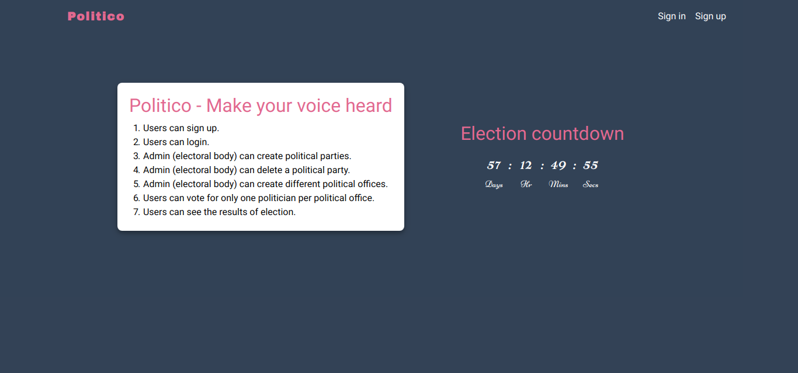

[](https://github.com/ChegeBryan/politico/blob/master/LICENSE)


# Politico
<p align=center>
<br>

<a href="https://chegebryan.github.io/politico/UI">View UI</a> Hosted with ❤️ at Github pages
</br>

</p>

### Project Description
Politico enables citizens give their mandate to politicians running for
different government offices while building trust in the process through
transparency.

### Features
1. Users can sign up.
2. Users can login.
3. Admin (electoral body) can create political parties.
4. Admin (electoral body) can delete a political party.
5. Admin (electoral body) can create different political offices .
6. Users can vote for only one politician per political office .
7. Users can see the results of election.

### Bonus features
1. User can reset password.
2. A politician can create a petition against a concluded political office
   election.


## Getting started
These instructions will get you a copy of the project up and running on your local machine for development and testing purposes.

## Prerequisites

- python 3.6
- pip3

If you wish to clone the repo please satisfy the requirements in the requirements.txt

## Installing

```
clone the repo to local machine

git clone https://github.com/ChegeBryan/politico.git

pip3 install virtualenv

```
### Create a virtual environment and install requirements
- Navigate to the cloned repo directory and open terminal from there.
- run `virtualenv venv` to create virtual environment with the name `venv`
- activate the virtualenv by `source venv/bin/activate`
- `pip3 install -r requirements.txt` to install app requirements on your virtual environment

### Starting the server
- set APP_SETTING variable `export APP_SETTING=development`
- followed by `python manage.py run`

### Running the tests
- run `pytest` at the app root directory
- run with coverage `pytest --cov=app/tests`

### Powered by

<a href="http://flask.pocoo.org/"></a>

### Contributing
<br>Contributions will be highly appreciated. Make a pull request and lets build
software together.

### Authors
[Chege Brian](https://github.com/ChegeBryan)

